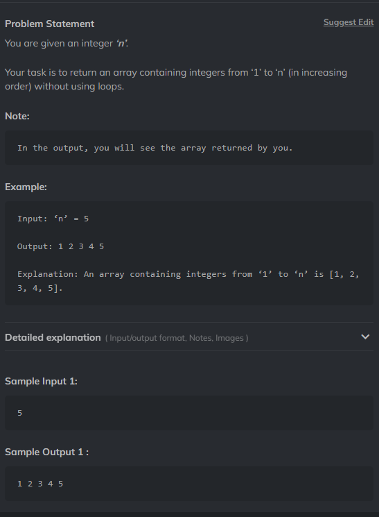

# Question 3



## Don't use conditional statements to achive this

### simply use recursion

### In python you can also use list for example

``` Python
    from typing import List
    def printNos(x:int)->List[int]:
        return list(range(1,x+1))
```
