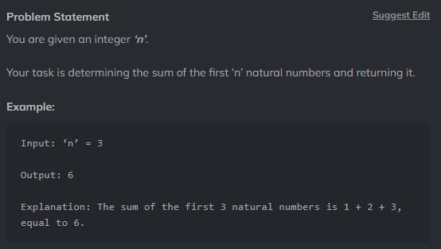

# Question 5



## Can use simple for loop to achieve this

### Another aproach is to use natural equation for sum of n numbers: n(n+1)/2

``` Python
    from typing import List
    def sum(x:int)->int:
        return x*(x+1)/2
```
