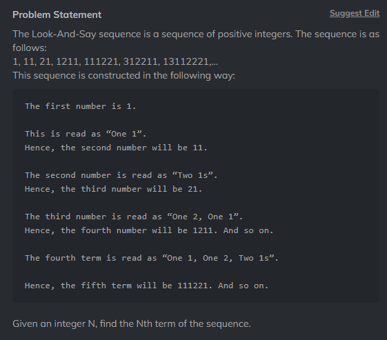

# Question 7

## This question is little tricky

### The logi isc to store each digit in a previous digit array and take a prev digit then comapre its each digit with next digit and if its equal then increment the count and if not append the count with previous digit and repeat the above step with next digit until there is no digit left in the number

### U can also use reccursion to solve this problem
