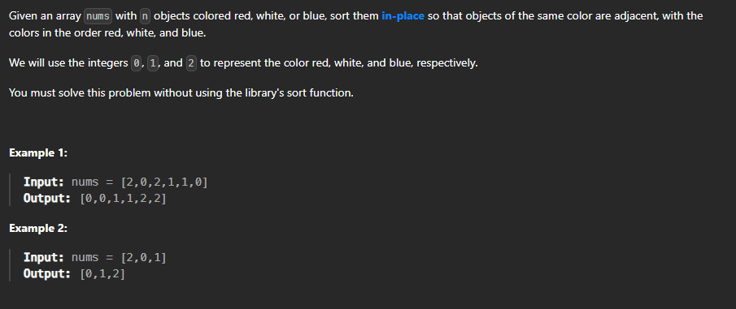

# Question 8



## This question is sort array of 0,1,2 without using any sorting algorithm

### The logic to take three variables low, mid and high and take mid as 0 and low as 0 and high as n-1 and then check if mid is 0 then swap mid with low and increment both mid and low and if mid is 1 then increment mid and if mid is 2 then swap mid with high and decrement high and repeat the above steps until mid is less than or equal to high

### The code is given below in python, complxity is O(n) and space complexity is O(1)

```python
def sort012(arr,n):
    low=0
    mid=0
    high=n-1
    while(mid<=high):
        if(arr[mid]==0):
            arr[mid],arr[low]=arr[low],arr[mid]
            mid+=1
            low+=1
        elif(arr[mid]==1):
            mid+=1
        else:
            arr[mid],arr[high]=arr[high],arr[mid]
            high-=1
    return arr
```

### the logic i usecd was to find the count of 0,1,2 and then replace the array with 0,1,2 according to their count and its in O(n) time complexity and O(1) space complexity
